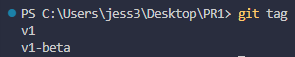
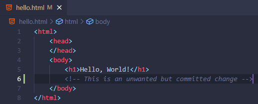
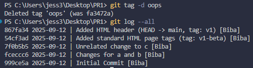

# Проходження інтерактивного курсу «Git How To»

  
<h2>Частина 1</h2>

  

    
<h3>1. Фінальні приготування</h3>

  #### `01 Встановлюємо ім'я та адресу електронної пошти`

  

  #### `02 Назва гілки за замовчуванням####`

  

  #### `03 Коректна обробка закінчень рядків`

  

  

  

    
<h3>2. Створення проєкту</h3>

  #### `01 Створіть сторінку «Hello, World»`

  

  #### `02 Створіть репозиторій`

  

  #### `03 Додайте сторінку у репозиторій`

  

  

  

    
<h3>3. Перевірка стану</h3>

  #### `01 Перевірте стан репозиторія`

  

  

  

    
<h3>4. Внесення змін</h3>

  #### `01 Змініть сторінку «Hello, World»`

  

  #### `02 Перевірте стан`

  

  

  

    
<h3>5. Індексація змін</h3>

  #### `01 Додайте зміни`

  

  

  

    
<h3>6. Індексація та коміт</h3>

  

  

  

    
<h3>7. Коміт змін</h3>

  #### `01 Закомітьте зміни`

  

  #### `02 Перевірте стан`

  

  

  

    
<h3>8. Зміни, а не файли</h3>

  #### `01 Перша зміна: Додайте стандартні теги сторінок`

  

  #### `02 Додайте ці зміни`

  

  #### `03 Друга зміна: Додайте заголовок HTML`

  

  #### `04 Перевірте поточний статус`

  

  #### `05 Коміт`

  

  #### `06 Додайте другу зміну`

  

  #### `07 Зробіть коміт другої зміни`

  

  

  

    
<h3>9. Історія проєкту</h3>

  #### `01 Однорядкова історія`

  

  #### `02 Контроль відображення записів`

  

  #### `03 Ухитряємося`

  

  #### `04 Кінцевий формат історії`

  
  

  

  

    
<h3>10. Отримання старих версій</h3>

  #### `01 Отримайте хеші попередніх комітів`

  
  

  #### `02 Поверніться до останньої версії в гілці main`

  

  

  

    
<h3>11. Створення тегів версій</h3>

  #### `01 Створіть тег першої версії`

  

  #### `02 Теги для попередніх версій`

  
  

  #### `03 Перемикання за ім'ям тегу`

  

  #### `04 Перегляд тегів за допомогою команди tag`

  

  #### `05 Перегляд тегів у логах`

  

  

  

    
<h3>12. Скасування локальних змін (до індексації)</h3>

  #### `01 Перейдіть на гілку main`

  

  #### `02 Змініть hello.html`

  

  #### `03 Перевірте стан`

  

  #### `04 Скасування змін в робочій директорії`

  

  

  

    
<h3>13. Скасування проіндексованих змін (перед комітом)</h3>

  #### `Внесіть зміни у файл і проіндексуйте їх`

  

  #### `02 Перевірте стан`

  

  #### `03 Відновлення індексу`

  

  #### `04 Відновлення файлу`

  

  

  

    
<h3>14. Скасування комітів</h3>

  #### `01 Скасування комітів`

  #### `02 Змініть файл і зробіть коміт`

  
  

  #### `03 Зробіть коміт з новими змінами, що скасовують попередні`

  

  #### `04 Перевірте лог`

  

  

  

    
<h3>15. Видалення комітів з гілки (revert)</h3>

  #### `01 Команда reset`

  #### `02 Перевірте нашу історію`

  

  #### `03 Для початку позначте цю гілку`

  

  #### `04 Відкіт до коміту, що передує до oops`

  

  #### `05 Нічого ніколи не губиться`

  

  

  

    
<h3>16. Видалення тегу oops</h3>

  #### `01 Видалення тегу oops`

  

  

  

    
<h3>17. Внесення змін до комітів</h3>

  #### `01 Змініть сторінку, а потім зробіть коміт`

  
  

  #### `02 Ой... необхідний email`

  

  #### `03 Змініть попередній коміт`

  

  #### `04 Перегляд історії`

  

  

  

    
<h3>18. Створення гілки</h3>

  #### `01 Створіть гілку`

  

  #### `02 Додайте файл стилів style.css`

  
  

  #### `03 Змініть hello.html для того, щоб використовувати style.css`

  
  

  

  

    
<h3>19. Перемикання гілок</h3>

  #### `01 Перемикання на гілку main`

  

  #### `02 Повернемося до гілки style`

  

  

  

    
<h3>20. Переміщення файлів</h3>

  #### `01 Перегляд історії змін конкретного файлу`

  

  #### `02 Перегляд різниці між версіями певного файлу`

  

  #### `03 Перейменуйте hello.html.`

  
  

  #### `04 Безпечне переміщення файлу style.css`

  
  

  

  

    
<h3>21. Зміни в гілці main</h3>

  #### `01 Створіть файл README`

  

  #### `02 Закомітьте файл README у гілку main`

  

  

  

    
<h3>22. Перегляд розбіжних гілок</h3>

  #### `01 Перегляньте поточні гілки`

  

  

  

    
<h3>23. Злиття</h3>

  #### `01 Злиття гілок`

  

  

  

    
<h3>24. Створення конфлікту</h3>

  #### `01 Поверніться у main і створіть конфлікт`

  
  
  

  #### `02 Перегляд гілок`

  

  

  

    
<h3>25. Вирішення конфліктів</h3>

  #### `01 Злиття main до гілки style`

  
  
  

  #### `02 Скасування злиття`

  

  #### `03 Рішення конфлікту`

  

  #### `04 Зробіть коміт з розв'язаним конфліктому`

  
  

  

  

    
<h3>26. rebase проти merge</h3>

  Розгляньмо відмінності між злиттям і перебазуванням. Для того, щоб це зробити, нам потрібно повернутися в репозиторій в момент до першого злиття, а потім повторити ті ж дії, але з використанням перебазування замість злиття.

  

  

    
<h3>27. Відкочування гілки style</h3>

  #### `01 Відкотіть гілку style`

  
  

  #### `02 Перевірте гілку`

  

  

  

    
<h3>28. Перебазування</h3>

  #### `01 Перебазуйте гілку style на main.`

  

  #### `02 Розв'яжіть конфлікт`

  
  
  

  

  

    
<h3>29. Злиття в гілку main</h3>

  #### `01 Злиття style в main`

  

  #### `02 Перегляньте логи`

  

  

